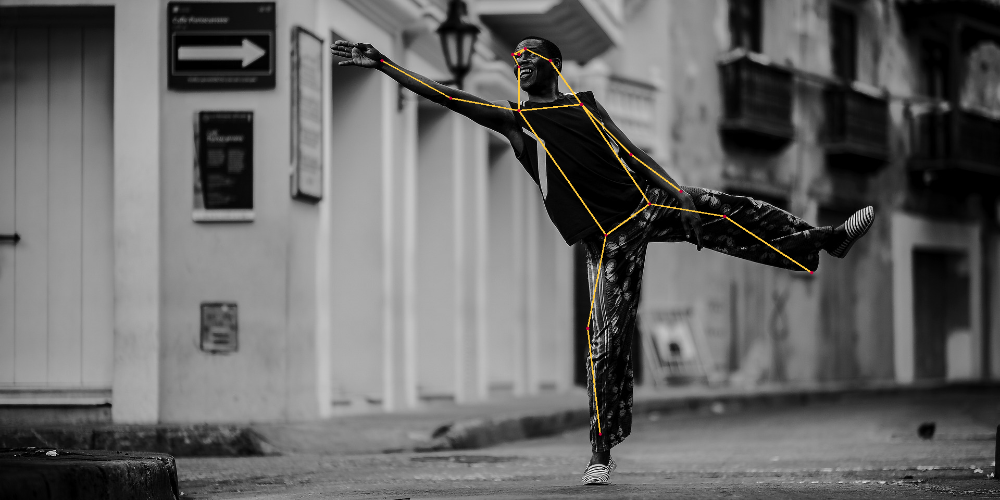
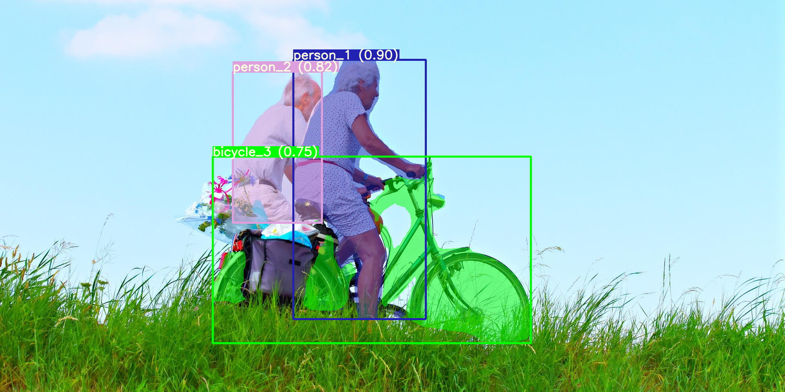

# Warboy-Vision-Models
The `warboy-vision-models` project is designed to assist users in running various deep learning vision models on [FuriosaAI](https://furiosa.ai/)’s first generation NPU (Neural Processing Unit), Warboy. 
Users can follow the outlined steps in the project to execute various vision applications, such as Object Detection, Pose Estimation, Instance Segmentation, etc., alongside Warboy.

We hope that the resources here will help you utilize the FuriosaAI Warboy in your applications.

# <div align="center">Model List</div>

Currently, the project supports all vision applications provided by YOLO series ([YOLOv9](https://github.com/WongKinYiu/yolov9), [YOLOv8](https://github.com/ultralytics/ultralytics), [YOLOv7](https://github.com/WongKinYiu/yolov7) and [YOLOv5](https://github.com/ultralytics/yolov5)). If you want to explore all available models in the `warboy-vision-models` repository and detailed performance on Warboy, please refer to the following:

### Object Detection
Object detection is a computer vision technique used to identify the presence of specific objects in images or videos and determines their locations. It entails classifying objects in videos or photos (classification) and precisely locating them using bounding boxes, thereby detecting objects through this process.

<div align="center"></div>


<details><summary>Performance on Warboy</summary>

<div align="center">

| Model     | Input Size<br><sup>(pixels) | mAP<sup>val<br>50-95 (FP32) | mAP<sup>val<br>50-95 (INT8) | Warboy Speed<sup>Fusion<br>(ms) | Warboy Speed<sup>Single PE<br>(ms) |
| --------- | --------------------------- | --------------------------- | --------------------------- | ------------------------------- | ---------------------------------- |
| YOLOv9t   | 640x640                     | 38.3                        | 35.4                        | 2.13  (4.60)                    | 2.60  (4.94)                       |
| YOLOv9s   | 640x640                     | 46.8                        | 43.4                        | 3.78  (6.40)                    | 5.36  (8.01)                       |
| YOLOv9m   | 640x640                     | 51.4                        | 48.6                        | 9.21  (10.61)                   | 12.59 (14.28)                      |
| YOLOv9c   | 640x640                     | 53.0                        | 49.5                        | 9.75  (11.12)                   | 14.86 (17.38)                      |
| YOLOv9e   | 640x640                     | 55.6                        |                             |                                 |                                    |
| YOLOv8n   | 640x640                     | 37.3                        | 34.7                        | 1.51  (4.10)                    | 1.89  (4.86)                       |
| YOLOv8s   | 640x640                     | 44.9                        | 42.4                        | 2.97  (5.26)                    | 4.17  (10.67)                      |
| YOLOv8m   | 640x640                     | 50.2                        | 47.6                        | 8.22  (10.03)                   | 11.67 (13.23)                      |
| YOLOv8l   | 640x640                     | 52.9                        | 50.4                        | 15.22 (16.83)                   | 24.69 (26.41)                      |
| YOLOv8x   | 640x640                     | 53.9                        | 51.4                        | 26.81 (28.41)                   |                                    |
| YOLOv7    | 640x640                     | 51.4                        | 47.9                        | 8.76  (14.22)                   |                                    |
| YOLOv7x   | 640x640                     | 53.1                        | 49.7                        | 15.61 (17.79)                   |                                    |
| YOLOv5nu  | 640x640                     | 34.3                        | 31.8                        | 1.15  (3.83)                    | 1.34  (4.44)                       |
| YOLOv5su  | 640x640                     | 43.0                        | 40.4                        | 2.14  (4.90)                    | 2.95  (9.59)                       |
| YOLOv5mu  | 640x640                     | 49.0                        | 46.3                        | 4.77  (6.42)                    | 6.49  (8.08)                       |
| YOLOv5lu  | 640x640                     | 52.2                        | 49.2                        | 8.89  (11.14)                   | 11.75 (14.35)                      |
| YOLOv5xu  | 640x640                     | 53.2                        | 50.4                        | 16.51 (17.88)                   | 22.98 (24.39)                      |
| YOLOv5n6u | 1280x1280                   | 42.1                        | 39.1                        | 2.67  (13.93)                   |                                    |
| YOLOv5s6u | 1280x1280                   | 48.6                        | 45.5                        | 5.86  (15.55)                   |                                    |
| YOLOv5m6u | 1280x1280                   | 53.6                        | 50.0                        | 13.76 (20.96)                   |                                    |
| YOLOv5l6u | 1280x1280                   | 55.7                        | 51.8                        | 41.85 (47.08)                   |                                    |
| YOLOv5x6u | 1280x1280                   | 56.8                        | 53.1                        |                                 |                                    |
| YOLOv5n   | 640x640                     | 28.0                        | 26.0                        | 1.09  (8.00)                    | 1.26  (8.83)                       |
| YOLOv5s   | 640x640                     | 37.4                        | 35.5                        | 1.93  (8.56)                    | 2.45  (8.92)                       |
| YOLOv5m   | 640x640                     | 45.4                        | 43.0                        | 4.44  (12.39)                   | 5.88  (12.25)                      |
| YOLOv5l   | 640x640                     | 49.0                        | 46.7                        | 7.70  (14.44)                   | 10.33 (16.15)                      |
| YOLOv5x   | 640x640                     | 50.7                        | 48.7                        | 14.39 (19.66)                   | 20.49 (23.77)                      |
| YOLOv5n6  | 1280x1280                   | 36.0                        | 33.3                        | 2.64  (28.29)                   | 3.51  (29.14)                      |
| YOLOv5s6  | 1280x1280                   | 44.8                        | 41.9                        | 5.43  (33.10)                   |                                    |
| YOLOv5m6  | 1280x1280                   | 51.3                        | 48.7                        | 12.73 (39.07)                   |                                    |
| YOLOv5l6  | 1280x1280                   | 53.7                        | 50.9                        | 39.17 (63.08)                   |                                    |
| YOLOv5x6  | 1280x1280                   | 55.0                        | 52.3                        |                                 |                                    |

</div>

</details>

### Pose Estimation
Pose estimation is a technology that identifies and estimates the posture of a person or object by detecting body parts (typically joints) and using them to estimate the pose of the respective object.

<div align="center"></div>

<details><summary>Performance on Warboy</summary>

<div align="center">
  
| Model        | Input Size<br><sup>(pixels) | mAP<sup>pose<br>50-95 (FP32) | mAP<sup>pose<br>50-95 (INT8) | Warboy Speed<sup>Fusion<br>(ms) | Warboy Speed<sup>Single PE<br>(ms) |
| ------------ | --------------------------- | ---------------------------- | ---------------------------- | ------------------------------- | ---------------------------------- |
| YOLOv8n-pose | 640x640                     | 50.4                         | 47.6                         | 1.54  (3.59)                    | 1.90  (4.06)                       |
| YOLOv8s-pose | 640x640                     | 60.0                         | 56.7                         | 3.06  (4.76)                    | 4.14  (5.37)                       |
| YOLOv8m-pose | 640x640                     | 65.0                         | 62.2                         | 8.36  (9.45)                    | 11.9  (13.05)                      |
| YOLOv8l-pose | 640x640                     | 67.6                         | 65.0                         | 15.31 (16.43)                   | 24.89 (26.10)                      |
| YOLOv8x-pose | 640x640                     | 69.2                         | 66.6                         | 27.55 (28.85)                   |                                    |
</div>

</details>

### Instance Segmentation 
Instance segmentation is a technology that identifies multiple objects in an image or video and delineates the boundaries of each object. In essence, it combines Object Detection and Semantic Segmentation techniques to individually identify multiple objects belonging to the same class and estimate their boundaries.

<div align="center"></div>

<details><summary>Performance on Warboy</summary>

<div align="center">
  
| Model       | Input Size<br><sup>(pixels) | mAP<sup>box<br>50-95 (FP32) | mAP<sup>box<br>50-95 (INT8) | mAP<sup>mask<br>50-95 (FP32) | mAP<sup>mask<br>50-95 (INT8) | Warboy Speed<sup>Fusion<br>(ms) | Warboy Speed<sup>Single PE<br>(ms) |
| ----------- | --------------------------- | --------------------------- | --------------------------- | ---------------------------- | ---------------------------- | ------------------------------- | ---------------------------------- |
| YOLOv9c-seg | 640x640                     | 52.4                        | 49.5                        | 42.2                         | 39.3                         | 2.13  (4.60)                    | 2.60  (4.94)                       |
| YOLOv9e-seg | 640x640                     | 55.1                        |                             | 44.3                         |                              | 3.78  (6.40)                    | 5.36  (8.01)                       |
| YOLOv8n-seg | 640x640                     | 36.7                        | 33.9                        | 30.5                         | 27.8                         | 9.21  (10.61)                   | 12.59 (14.28)                      |
| YOLOv8s-seg | 640x640                     | 44.6                        | 42.2                        | 36.8                         | 34.2                         | 9.75  (11.12)                   | 14.86 (17.38)                      |
| YOLOv8m-seg | 640x640                     | 49.9                        | 47.3                        | 40.8                         | 38.2                         |                                 |                                    |
| YOLOv8l-seg | 640x640                     | 52.3                        | 49.1                        | 42.6                         | 39.3                         | 1.51  (4.10)                    | 1.89  (4.86)                       |
| YOLOv8x-seg | 640x640                     | 53.4                        | 50.4                        | 43.4                         | 40.1                         | 2.97  (5.26)                    | 4.17  (10.67)                      |
</div>

</details>

# <div align="center">Documentation</div>
Please refer below for a installation and usage example. 

## Installation
To use this project, it's essential to install various software components provided by FuriosaAI. For detailed instructions on installing packages, drivers, and the Furiosa SDK, please see the following:

- **Driver, Firmeware and Runtime Installation** ([English](https://furiosa-ai.github.io/docs/latest/en/software/installation.html) | [한국어](https://furiosa-ai.github.io/docs/latest/ko/software/installation.html))


Python SDK requires Python 3.8 or above. pip install required python packages as follows,
```sh
pip install -r requirements.txt
```
and apt install required packages for post processing utilites.
```sh
sudo apt-get update
sudo apt-get install cmake libeigen3-dev
./build.sh
```

## Usage Example

<details open>
<summary> Download the coco2017 dataset </summary>
  
If needed, download the coco2017 dataset. You can skip this step if you have your own dataset.
  
```sh
./coco2017.sh
```    
</details>

<details open>
<summary> Download the demo videos </summary>
  
If needed, you can download object detection, pose estimation demo videos from warboy_tutorials. You can skip this step if you have your own videos.
  
```sh
./demo_videos.sh
```    
</details>

<details open>
<summary> Set config files for project </summary>

Before running the project, you need to set up configuration files for model and demo. 

- **Model config file** : it contains parameters about the model and quantization. 
```yaml
application: object_detection                                                   # vision task (object detection | pose estimation | instance segmentation)
model_name: yolov8n                                                             # model name
weight: ./models/weight/object_detection/yolov8n.pt                             # weight file path
onnx_path: ./models/onnx/object_detection/yolov8n.onnx                          # onnx model path
onnx_i8_path: ./models/quantized_onnx/object_detection/yolov8n_i8.onnx          # quantized onnx model path

calibration_params:
  calibration_method: SQNR_ASYM                     # calibration method
  calibration_data: ./datasets/coco/val2017         # calibration data path
  num_calibration_data: 10                          # number of calibration data

confidence_threshold: 0.25
iou_threshold: 0.7
input_shape: [640, 640]         # model input shape (Height, Width)
anchors:                        # anchor information
  - 
class_names:                    # class names
  - ...
```

- **Demo config file** : it contains device informations and video paths for the project.

```yaml
application: object_detection
model_config: ./warboy_vision_models/warboy/cfg/model_config/object_detection/yolov8n.yaml          # model config file path
model_path: ./models/quantized_onnx/object_detection/yolov8n_i8.onnx                                # quantized onnx model path
num_workers: 8                                                                                      
device: warboy(2)*1                                                                                 # device name (warboy(2)*1 | warboy(1)*1 | npu0pe0 | etc.)
video_path: 
  - [set your test video file path]
```
</details>

<details open>
<summary> Make CLI tool </summary>

- **command**
  ```sh
  pip install .
  ```

</details>


</details>

<details open>
<summary> Export ONNX & Quantizing an ONNX model using Furiosa SDK </summary>
Next, it is necessary to export the model to the ONNX format. 

If you have the model in an ONNX model, the next step is the model quantization process. Since FuriosaAI's Warboy only supports models in 8-bit integer format (int8), it is necessary to quantize the float32-based model into an int8 data type model. 

- **command with cli**
  ```sh
  warboy-vision make-model "/path/to/your/model/cfg.yaml"       # from onnx export to quantize

  # if you want to export onnx model
  warboy-vision export-onnx "/path/to/your/model/cfg.yaml"      # export onnx

  # if you want to quantize onnx model
  warboy-vision quantize "/path/to/your/model/cfg.yaml"         # quantize
  ```
- **command with python**
  
  ```sh
  python warboy_vision_models/test_make_model.py      # please check test_make_model.py file
  ```
</details>

<details open>
<summary> Running the project using Furiosa Runtime </summary>
In the project, vision applications are executed for videos from multiple channels. To accomplish this effectively, optimization tasks such as Python parallel programming, asynchronous processing, and post-processing using C++ have been included. For a detailed understanding of the project structure, please refer to the following image:


<div align="center"></div>
  
- **command with cli**
  
  ```sh
  warboy-vision web-demo "/path/to/your/demo/cfg.yaml"    # see the result on webpage using fastAPI (http://0.0.0.0:20001 or http://localhost:20001)

  warboy-vision make-file "/path/to/your/demo/cfg.yaml"   # outputs will be saved in outputs folder
  ```
- **command with python**
  
  ```sh
  python warboy_vision_models/demo/demo.py web      # see the result on webpage using fastAPI (http://0.0.0.0:20001 or http://localhost:20001)

  python warboy_vision_models/demo/demo.py file     # outputs will be saved in outputs folder
  ```
</details>

<details open>
<summary> End-to-end performance test </summary>
<!-- e2e test 설명 -->
In the project, there are end-to-end performance tests for various vision applications. We can test the performance of object detection, pose estimation, instance segmentation, and face recognition applications. Also, we can test NPU performance, too.

- **command with cli**
  
  ```sh
  warboy-vision performance "/path/to/your/model/cfg.yaml"      # performance test for model with config file

  warboy-vision npu-profile "/path/to/your/model/cfg.yaml"      # NPU performance test for model with config file
  ```
- **command with python**
  
  ```sh
  python warboy_vision_models/test_acc.py     # for model performance test, please check test_acc.py file

  python warboy_vision_models/test_npu.py     # for NPU performance test, please check test_npu_performance.py file
  ```

- **command with cli without config file**

    ```sh

    warboy-vision object-detection "model_name" "/path/to/your/quantized/model.onnx"          # object detection performance test
    warboy-vision pose-estimation "model_name" "/path/to/your/quantized/model.onnx"           # pose estimation performance test
    warboy-vision instance-segmentation "model_name" "/path/to/your/quantized/model.onnx"     # instance segmentation performance test

    # can check supported models in warboy_vision_models/tests/test_config
    ```
</details>
